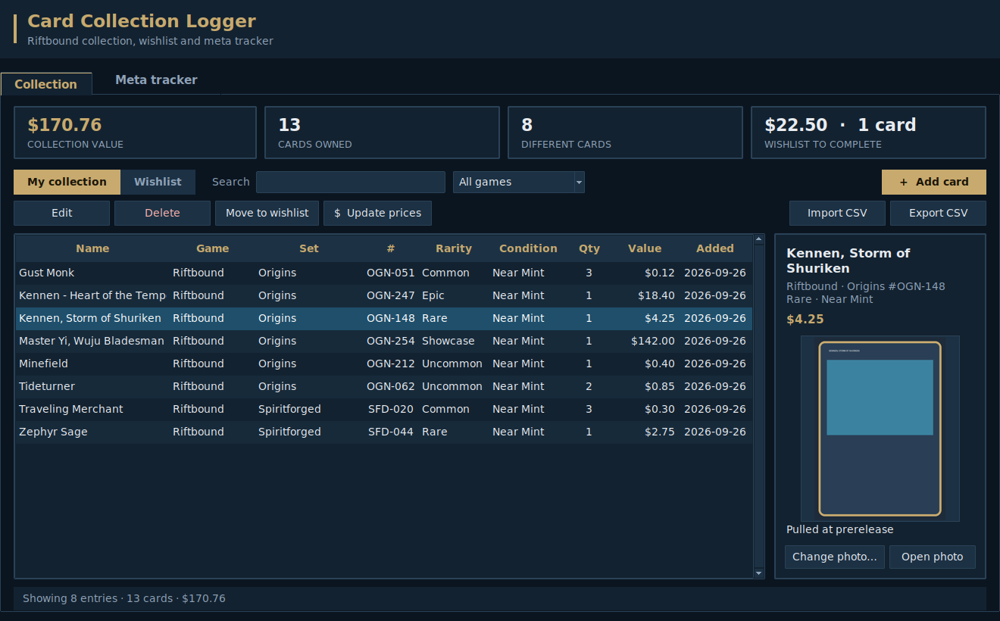
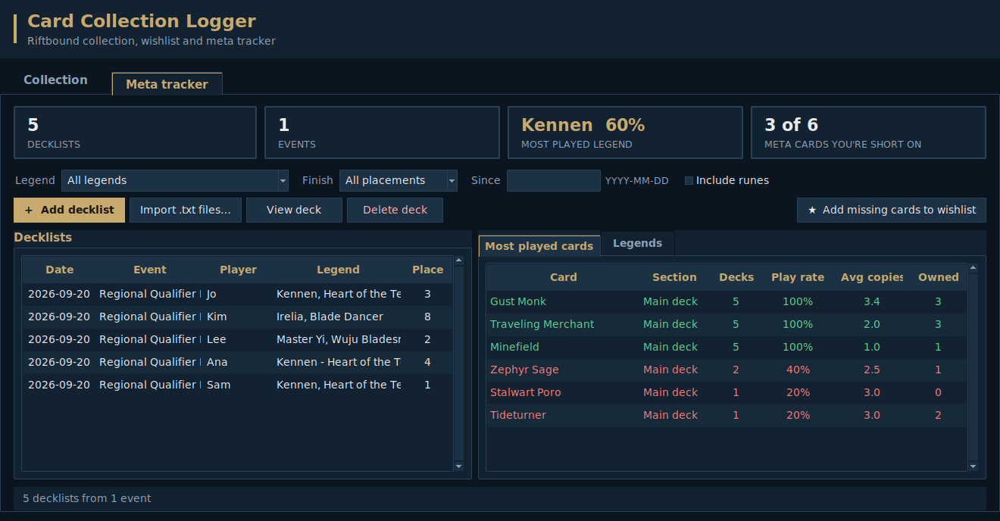
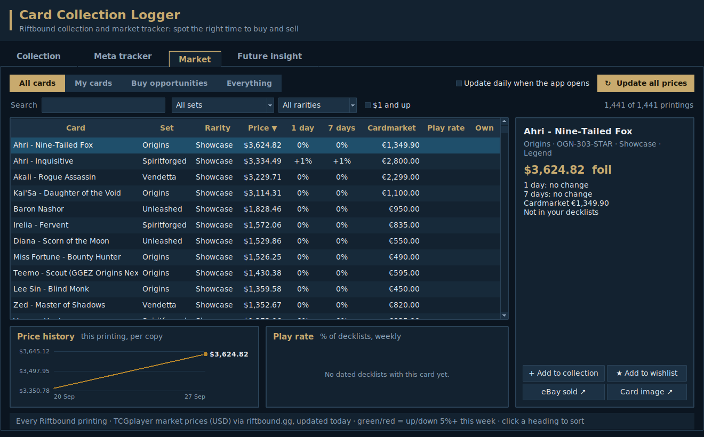
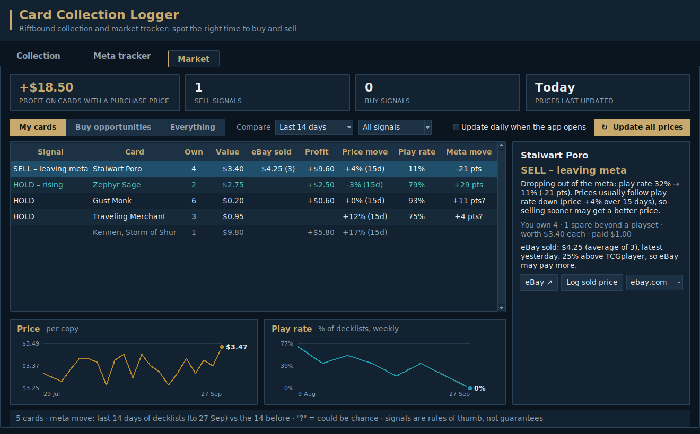
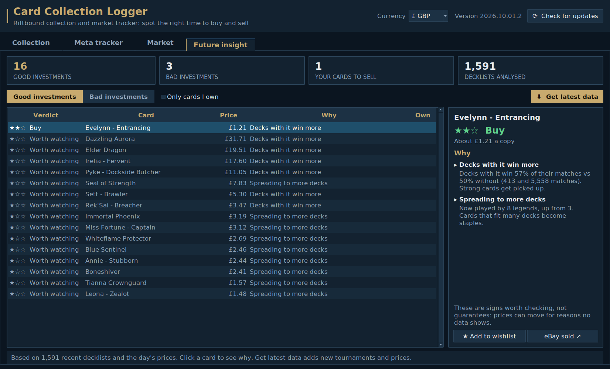

# Card Collection Logger

A desktop tool for buying and selling **Riftbound** cards (the League of
Legends TCG). It tracks your collection, what you paid, how prices move and
which cards the competitive meta is starting to play. From that it tells you
when a card looks like a good sell or an early buy. It works for other card
games too, apart from the meta tracking.

It runs on your own computer and has no extra packages to install. Only price
lookups need the internet.











## What it does

- Add, edit and delete cards: name, game, set, card number, rarity,
  condition, quantity, value and notes
- Search as you type, and filter by game
- Click a column heading to sort by it (click again to reverse)
- Shows how many cards you have and what they're worth, for the current
  view and for the whole collection
- **Card photos:** attach a photo to each card and see it beside the list
- **Wishlist:** keep a separate list of cards you want, with the total cost
  to complete it; tick "Mark as owned" when you get one
- **Price lookup:** fetch current market prices for Riftbound, Magic,
  Pokémon and Yu-Gi-Oh! cards (see below)
- **Market signals:** sell, hold and buy suggestions from each card's price
  history and meta trend, with charts and your profit (see below)
- **Future insight:** early warning signs of cards likely to become popular,
  before the rise shows up in play rates (see below)
- **Meta tracker:** save tournament decklists and see which cards and
  legends are played most, how many copies decks run, and which of those
  cards you're missing (see below)
- Export your collection and wishlist to a CSV file (opens in Excel / Google
  Sheets), or import cards from a CSV

## Requirements

Python 3.10 or newer.

- **Windows / macOS:** install Python from <https://www.python.org/downloads/>.
  It includes everything the program needs.
- **Linux:** install Python plus Tk, e.g. `sudo apt install python3 python3-tk`.

## Running it

- **Windows:** double-click `start_card_logger.pyw`.
- **Any system:** open a terminal in this folder and run

  ```
  python -m card_logger
  ```

  (use `python3` instead of `python` on macOS/Linux).

## Photos

Select a card and click **Add photo…** (or choose one in the Add/Edit form).
The photo is copied into the program's own folder, so moving or deleting the
original afterwards is fine.

PNG and GIF photos preview out of the box. To preview JPEG (most phone
photos) and other formats too, install Pillow once:

```
python -m pip install pillow
```

Without Pillow, **Open photo** still opens any photo in your normal viewer.

## Wishlist

Switch between **My collection** and **Wishlist** at the top left. Cards on
the wishlist don't count towards your collection's totals. Use
**Move to wishlist** / **Mark as owned** to move selected cards between the
two, or tick "On my wishlist" in the Add/Edit form.

## Price lookup

Prices come from free public databases, in US dollars, based on TCGplayer
market prices. An internet connection is needed. The card's **Game** must be
one of these:

| Game | Source |
| --- | --- |
| Riftbound | TCGplayer prices, via [TCGCSV](https://tcgcsv.com) |
| Magic (or "MTG", "Magic: The Gathering") | [Scryfall](https://scryfall.com) |
| Pokémon | [Pokémon TCG API](https://pokemontcg.io) |
| Yu-Gi-Oh! | [YGOPRODeck](https://ygoprodeck.com) |

Sports and other cards don't have a free price service, so enter those
values yourself.

- In the Add/Edit form, **Look up price** fills in the value and shows which
  printing it matched. Check it before saving.
- **Update prices** refreshes the value of the selected cards, or every card
  shown if none are selected.

The more you fill in, the better the match. **Set** and **Card number**
pick the exact printing. Putting "foil", "holo", "reverse holo" or "1st
edition" in Rarity or Notes picks that version's price. For Yu-Gi-Oh!, you
can put the set code (e.g. `LOB-EN005`) in Card number.

For Riftbound:

- Enter the card number as printed, e.g. `OGN-148`. The set code at the
  front picks the set, so you can leave Set blank.
- For showcase or alternate-art cards, set Rarity to "Showcase", or write
  "alt art" in Notes.
- Write "foil" in Notes to get the foil price.
- The first lookup in a session downloads the set's price list, which takes
  a few seconds. Lookups after that are quick.

## Meta tracker

The **Meta tracker** tab shows what the competitive decks are playing.

### Automatic import

Click **Import decklists** and choose the sources.

#### TopDeck.gg tournaments (recommended for recent results)

[TopDeck.gg](https://topdeck.gg) runs many Riftbound tournaments, from store
events to large qualifiers, and has a free official API. The import brings
in recent tournaments with each player's **placing, win/loss record, legend
and decklist**. The records are what power the "Wins more" sign in Future
insight.

It needs a free API key:

1. In the Import decklists window, click **Get a free key ↗**. TopDeck.gg's
   developer page opens.
2. Sign in and create a key.
3. Paste it into **API key**. It's saved only on your computer.

It imports Constructed events (the standard competitive format).
**Minimum players** skips small events; raise it to focus on bigger,
more competitive ones. Decklists appear once an event has finished, and only
for players whose list the organiser made public. TopDeck.gg asks apps to
credit it, so the Meta tracker shows "Tournament data provided by
TopDeck.gg".

The official Riftbound event system (the Event Locator) keeps decklists
private to organisers, so they can't be imported from there.

#### riftbound.gg

[riftbound.gg](https://riftbound.gg) provides two kinds:

- **Tournament decks**, with the event, its size and the player's placing.
  They're dated by when the event happened. Decks from events older than
  the look-back (or whose date riftbound.gg doesn't list) are skipped, so
  old results can't pose as new trends.
- **Community decks**, which are lists players have published recently.
  They're the freshest sign of what people are building (and buying).
  Copies of the same list count once.

Importing again only adds what's new. riftbound.gg only serves about its
newest 800 community decks (a few days' worth) at a time, so tick **Import
new decklists automatically each day** to build up a longer history. An
import takes a minute or two, because the site asks apps not to rush it.

riftbound.gg's data service isn't an officially documented API. If it
changes, the import fails with a clear message rather than importing bad
data, and the connection check (below) shows what changed.

### Adding decklists by hand

1. Find decklists on a meta site such as [riftDecks](https://riftdecks.com),
   [riftbound.gg](https://riftbound.gg) or
   [Piltover Archive](https://piltoverarchive.com). Copy the decklist text,
   or use the site's "Export as text".
2. Click **Add decklist…**, paste it in, and fill in the event, player,
   placement and date. The line under the box shows what was read (legend,
   number of main deck cards, runes, battlefields) so you can check it.
   To add many at once, save each deck as a `.txt` file and use
   **Import .txt files…**.
3. The **Most played cards** list shows each card's number of decks, % of
   decks, average copies, and how many you own. Green means you own enough
   copies and red means you're short. Runes and legends are left out unless
   you tick "Include runes".
4. The **Legends** list shows each legend's share of the meta and best
   finish. Double-click one to see just that legend's cards.
5. Narrow things down with **Legend**, **Finish** (e.g. only Top 8 decks)
   and **Since** (only decks from a date onwards).
6. Select cards (Ctrl+A for all) and click **Add missing cards to wishlist**.
   The missing copies go on your wishlist, where **Update prices** tells you
   what they'll cost.

Decklists can be in any of the common text formats: headings such as
`Legend:`, `Champion:`, `Main Deck:`, `Runes:`, `Battlefields:` and
`Sideboard:`, with quantities written `3 Card`, `3x Card`, `Card x3` or
`Card (x3)`. Lines with no heading count as the main deck.

The meta sites (riftDecks, riftbound.gg, Piltover Archive) don't offer a
public data feed, which is why those decklists are added by hand.

### Checking the live connections

Prices and tournament imports come from online services. To check they all
work on your computer, double-click `check_connections.py`, or run

```
python -m card_logger --check
```

It tries each service, shows PASS or FAIL with what it found (for example a
real price, or the first decklist of a recent tournament), and saves a report
to `.card_logger/connection-check.txt` in your home folder. If anything fails
for a reason other than your internet connection, that report shows exactly
what the service sent back, which is what's needed to fix it.

### Tips

- Double-click a row to edit it; press **Delete** to remove selected rows.
- Hold Ctrl/Shift to select several rows at once.
- To import a CSV, the first row must be a header. Only a `name` column is
  required; other recognised columns are `game`, `set_name`, `number`,
  `rarity`, `condition`, `quantity`, `value`, `notes`, `date_added`,
  `wishlist` (`yes` for wishlist cards), `image_path`. The
  easiest way to get the format right is to export first and copy it.

## Market tab: every card's price

The Market tab opens on **All cards**: every Riftbound printing (about
1,400, including showcase and promo versions) with:

- its current **TCGplayer price** (an "F" means the card only comes in foil);
- the **1-day and 7-day price change**, available from the very first
  download;
- the **Cardmarket** (EUR) price;
- its **play rate** in your decklists and how many copies you **own**.

Search by name or card code, filter by set and rarity, and click any column
heading to sort. For example, click **7 days** for the week's biggest movers
(tick **$1 and up** to skip penny cards). Select a card to see its price
history chart and weekly play rate, add it to your collection or wishlist,
check eBay's sold listings, or open the card image.

The price list downloads automatically the first time you open the app and
each day after that (while "Update daily when the app opens" is ticked), or
whenever you click **Update all prices**. Each day's prices are saved, so the
history charts grow over time.

## Market tab: when to sell or buy

The other Market views (**My cards**, **Buy opportunities**, **Everything**)
bring everything together. For every card you own (and
every meta card you don't), it shows:

- **Profit:** current value minus what you paid. Enter "Paid (each)" in the
  Add/Edit card form.
- **Price move:** how much the price has changed over the period you pick.
- **Play rate:** the share of recent decklists that play the card.
- **Meta move:** how the play rate changed in the chosen period (last 7, 14
  or 30 days of decklists) compared with the period before it, in
  percentage points. A "?" means the change could just be chance, because
  there weren't enough decklists to be sure.
- **Signal:** a suggestion with a plain explanation. Select a card to see
  the explanation next to charts of its price and weekly play rate.

| Signal | When | Why |
| --- | --- | --- |
| SELL – hype peak | You own it, play rate is rising **and** price is up 25%+ | Sell spare copies while demand is hot |
| SELL – leaving meta | You own it, play rate is falling 10+ points | Prices usually follow play rate down |
| SELL – price spike | You own it, price is up 25%+ without more play | Spikes without demand often fall back |
| HOLD – rising | You own it, play rate is rising 10+ points, price hasn't spiked | The price may not have caught up yet |
| BUY – early | You don't own it, play rate is rising, price is up less than 10% | Buy before the price reacts |
| WATCH – moving | You don't own it, play rate is rising, price already moving | May already be priced in |
| HOLD | Nothing unusual | |

A play-rate change only counts as rising or falling when there are at least
5 decklists in each period and the change is big enough not to be chance
(a z-score of 1.65 or more). These are rules of thumb from your own data, not
guarantees, so check recent sold listings before you buy or sell.

### eBay sold prices

eBay doesn't let apps read sold listings automatically:

- Its sold-price API (Marketplace Insights) needs business approval from
  eBay and isn't open to new users.
- The old free one (findCompletedItems) was shut down in 2025.
- Scraping eBay's pages is against eBay's user agreement.

So eBay prices are a quick manual step instead:

1. Select a card in the Market tab and click **eBay ↗**. eBay's sold
   listings for that card open in your browser, newest first. Pick your
   eBay site (ebay.com, ebay.co.uk, …) in the box next to the buttons.
2. Click **Log sold price** and enter a few of the prices you see.

The **eBay sold** column then shows the average of the last 30 days, and
the side panel tells you how it compares with the TCGplayer price. That
helps you decide where to sell. Enter prices in the same currency as your
other prices (TCGplayer prices are in US dollars).

### Keeping the data fresh

Signals are only as good as the data behind them:

- **Prices:** click **Update all prices** (or leave "Update daily when the
  app opens" ticked). It refreshes your collection and wishlist values and
  saves today's price for every Riftbound card, so cards you don't own get a
  price history too. Price charts fill in as the days go by.
- **Decklists:** add a TopDeck.gg key and turn on the daily import in the
  Meta tracker tab. Add other tournament results by hand, with their dates. Trends compare recent decklists with older ones, so a
  steady flow of dated lists is what makes early detection work.

## Future insight: cards that could be next

Nobody can know the future meta for certain. This tab looks for the
patterns that tend to come *before* a card takes off, and ranks cards by a
**watch score** (0–100): the more signs, and the stronger they are, the
higher the score. Select a card to see each sign explained with its numbers.

| Sign | What it means | Why it matters |
| --- | --- | --- |
| Top finishers | Decks in the top quarter of events play it much more than the rest | Players copy winning lists |
| Wins more | Decks with it win more of their games than decks without it | Strong but under-played cards get picked up |
| Climbing | Its play rate has been rising week on week from a low base | Early adoption, before it's a clear trend |
| Rising legend | It's in most lists of a legend whose meta share is growing | The card rises with its legend |
| Spreading | More legends have started playing it | Cards that fit many decks become staples |
| Price first | Its price is rising faster than its play rate | Buyers may be ahead of the tournament results |
| New | It showed up in decklists for the first time in the last two weeks | Something new is being tried |
| Unplayed, price up | Not in any decklist, but the price is up 25%+ in two weeks | The market may be betting on it early |

Cards already in 60%+ of decks are left out, since they're already the meta.
Signs only count when the difference is big enough not to be chance, and
nothing is judged until there are at least 20 decklists in the period.

**Legends on the move** shows which legends are gaining or losing meta share,
comparing the second half of the period with the first.

**Get latest data** imports new decklists from riftbound.gg and updates all
prices in one click. **Add to wishlist** and **eBay ↗** help you act on a
card.

The top-finishers sign needs placings, and the win-rate sign needs match
records. Both come with TopDeck.gg tournaments. Placings also come with
riftbound.gg tournament decks and with decklists you add by hand.

Signs that compare with earlier weeks (climbing, spreading, rising legends,
new arrivals) need a few weeks of history. After your first import the tab
says how many days it has, and they appear as daily imports build up.

These are signs to research, not predictions, and they can be wrong. Check
spoilers, ban announcements and recent sales before you buy.

## Where your data is stored

Your collection is saved automatically to `cards.db` in a `.card_logger`
folder inside your home folder (e.g. `C:\Users\you\.card_logger\cards.db`),
and card photos go in the `images` folder next to it. Meta tracker
decklists are saved in the same `cards.db` file. Back up the whole
`.card_logger` folder to keep your collection safe.

To use a different file, run `python -m card_logger --db path/to/file.db`
or set the `CARD_LOGGER_DB` environment variable.

## Running the tests

```
python -m unittest discover -s tests
```
